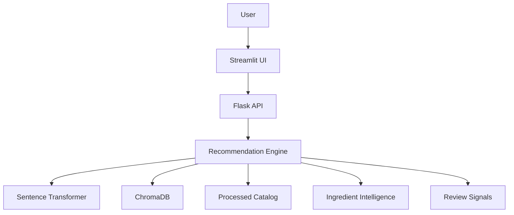

# DermaMatch AI

## 1. Project Overview
DermaMatch AI is an ingredient-aware skincare recommendation system. It allows users to find the best skincare products by matching their natural-language query or structured preferences (such as skin type, concerns, category, budget, preferred terms, and avoided ingredients) against a catalog of Sephora products and their associated reviews and ingredients.

## 2. Problem Statement
Many skincare recommendation systems rely on simple collaborative filtering or purely semantic search, often ignoring specific ingredient requirements (e.g., avoiding fragrance, seeking zinc oxide) or strict budget constraints. DermaMatch AI solves this by combining semantic retrieval with strict hard-filtering and deep ingredient intelligence.

## 3. Features
- **Natural Language Recommendations:** Query for products using natural language.
- **Skincare Quiz:** Use a structured interface to specify preferences.
- **Ingredient Intelligence:** Accurately matches desired ingredients and strictly avoids unwanted ones.
- **Review Evidence:** Extracts themes and recommendations from historical product reviews.
- **Explainability:** Provides detailed, deterministic reasons for why a product was recommended.

## 4. Architecture


## 5. Dataset
The recommendation system uses a processed skincare product catalog consisting of approximately 2,420 skincare products from Sephora, complete with review signals, pricing, and ingredient details.

## 6. Part 1 — Data Pipeline
The data pipeline (`DermaMatch_AI_Final_Data_Pipeline.ipynb`) handles the cleaning, processing, and generation of the recommendation catalog (`recommendation_catalog.csv`) from the raw dataset.

## 7. Part 2 — Recommendation Engine
The recommendation engine (`02_DermaMatch_Recommendation_Engine_FINAL_NO_ERROR.ipynb`) computes embeddings using the `BAAI/bge-small-en-v1.5` model, creates a persistent ChromaDB vector index, and extracts ingredient profiles and engine configurations into `data/artifacts/`.

## 8. Part 3 — Production Application
The final layer consists of a robust Flask REST API serving as the backend and a Streamlit UI providing a polished user experience. This layer encapsulates the single, unified recommendation logic established in Part 2.

## 9. Recommendation Algorithm
The algorithm flows as follows:
1. **Semantic Retrieval**: Uses `ChromaDB` to retrieve a broad candidate pool.
2. **Hard Constraints**: Immediately filters candidates that violate budget, category, or avoided-ingredient constraints.
3. **Scoring**: Applies scoring heuristics for ingredient matches, review themes, user preferences, and rating quality.
4. **Diversity & Final Ranking**: Reranks the candidates to ensure diversity and applies final scoring to produce the top K results.

## 10. Ingredient Intelligence
The system canonicalizes ingredients and identifies missing ingredient data. It ensures products with missing ingredient data do not produce false positive matches and reliably identifies products containing specified ingredients (e.g., Zinc).

## 11. Explainability
Every recommendation is accompanied by an explanation. The API returns deterministic reasons for the recommendation, such as whether a product matched the budget, the specific ingredients it matched, and any relevant review themes.

## 12. API Endpoints

### `GET /health`
Verifies that the API is running and the engine is ready.
```bash
curl http://127.0.0.1:5000/health
```

### `POST /api/recommend`
Accepts a natural-language query and optional constraints.
```bash
curl -X POST http://127.0.0.1:5000/api/recommend \
-H "Content-Type: application/json" \
-d '{
  "query": "lightweight sunscreen for oily acne-prone skin under $30",
  "top_k": 5
}'
```

### `POST /api/recommend/quiz`
Accepts a structured quiz payload.
```bash
curl -X POST http://127.0.0.1:5000/api/recommend/quiz \
-H "Content-Type: application/json" \
-d '{
  "skin_type": "oily",
  "concerns": ["acne"],
  "category": "sunscreen",
  "budget_max": 30,
  "preferred_terms": ["lightweight"],
  "avoid_ingredients": ["fragrance"],
  "top_k": 5
}'
```

### `GET /api/products`
Lists available products with optional `limit`, `offset`, `category`, and `brand` parameters.

### `GET /api/products/<product_id>`
Fetches details of a specific product by ID.

## 13. Streamlit UI
The Streamlit application (`streamlit_app/main.py`) offers a beautiful and intuitive interface with two modes:
1. **Natural Language**: A single text input for holistic queries.
2. **Skincare Quiz**: A structured form capturing detailed user preferences.

## 14. Project Structure
```
DermaMatch-AI/
├── data/                    # Processed catalog and artifacts (ChromaDB, embeddings)
├── notebooks/               # Data pipeline & Engine notebooks
├── app/                     # Flask REST API source code
├── tests/                   # Pytest suite
├── streamlit_app/           # Streamlit UI source code
├── Dockerfile               # Production API image
├── docker-compose.yml       # Orchestrates API & UI services
├── requirements.txt         # Project dependencies
├── run.py                   # Local development server entrypoint
└── .env.example             # Environment variables
```

## 15. Installation
```bash
# Clone the repository
git clone <repository-url>
cd DermaMatch-AI

# Install dependencies
pip install -r requirements.txt
```

## 16. Running Locally
Start the Flask API:
```bash
python run.py
```
In a separate terminal, start the Streamlit UI:
```bash
streamlit run streamlit_app/main.py
```

## 17. Running with Docker
You can easily spin up the entire application stack using Docker Compose:
```bash
docker-compose up --build
```
- API will be accessible at `http://localhost:5000`
- Streamlit UI will be accessible at `http://localhost:8501`

## 18. Testing
A comprehensive test suite validates API endpoints, recommendation constraints, and ingredient regressions.
```bash
# Set PYTHONPATH if needed, e.g., export PYTHONPATH=.
pytest tests/
```

## 19. Limitations
- The system is a prototype and not a medical diagnosis tool. Do not rely on it for medical advice.
- Some products in the catalog may lack complete ingredient profiles.

## 20. Future Improvements
- Periodically update the catalog to reflect newer products and discontinued lines.
- Implement caching in the API for identical queries.
- Support multi-modal inputs (e.g., uploading an image of a current skincare routine).
